|  Ziddan Makarim  |  312010063  |
|------------------|-------------|
|Pemrograman Web   |  Lab5Web    |

## 1). Membuat Javasripct Sederhana
### Hasil
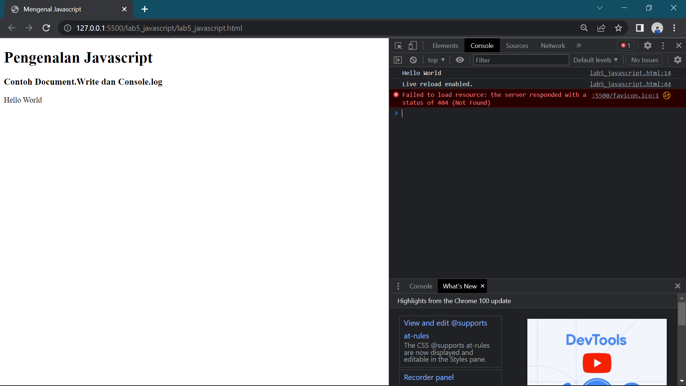

Membuat javascript sederhana dengan perintah document.write dan console.log

### Contoh Coding
```html
<!DOCTYPE html>
<html lang="en">
<head>
    <meta charset="UTF-8">
    <meta http-equiv="X-UA-Compatible" content="IE=edge">
    <meta name="viewport" content="width=device-width, initial-scale=1.0">
    <title>Mengenal Javascript</title>
</head>
<body>
    <h1>Pengenalan Javascript</h1>
    <h3>Contoh Document.Write dan Console.log</h3>
    <script lang="javascript">
        document.write("Hello World")
        console.log("Hello World")
    </script>
</body>
</html>
```

## 2). Javascript Dasar
### Hasil
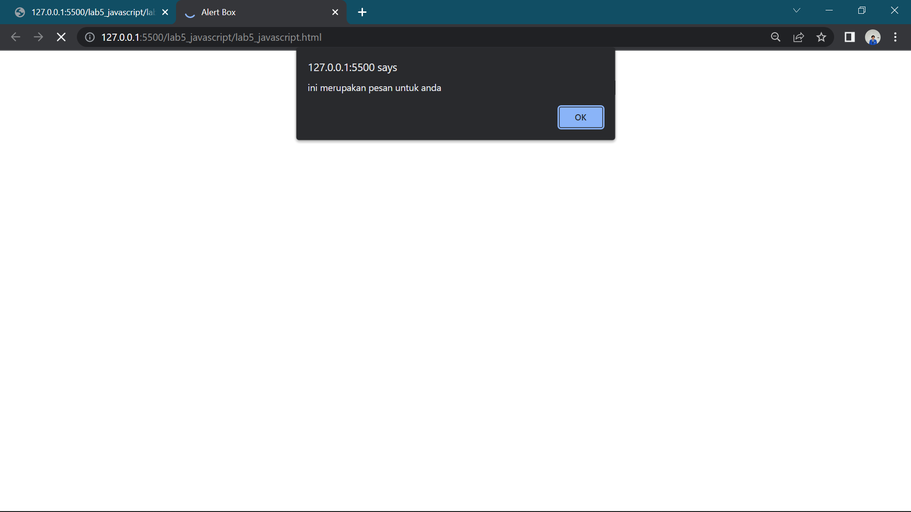

Properti alert untuk perintah pop

### Contoh Coding
```html
<!DOCTYPE html>
<html lang="en">
<head>
    <meta charset="UTF-8">
    <meta http-equiv="X-UA-Compatible" content="IE=edge">
    <meta name="viewport" content="width=device-width, initial-scale=1.0">
    <title>Alert Box</title>
</head>
<body>
    <script lang="javascript">
        window.alert("ini merupakan pesan untuk anda")
    </script>
</body>
</html>
```

## 3). Method Dalam Objek
### Hasil
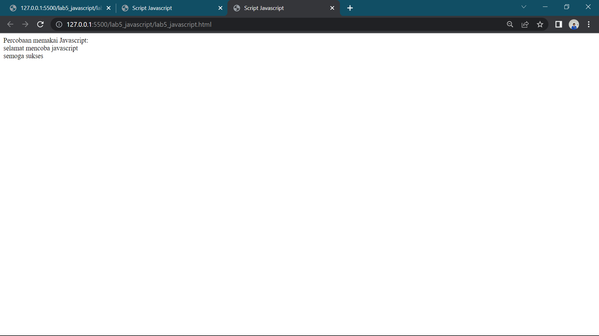

Menggunakan method dalam objek javascript

### Contoh Coding
```html
<!DOCTYPE html>
<html lang="en">
<head>
    <meta charset="UTF-8">
    <meta http-equiv="X-UA-Compatible" content="IE=edge">
    <meta name="viewport" content="width=device-width, initial-scale=1.0">
    <title>Script Javascript</title>
</head>
<body>
    Percobaan memakai Javascript:<br>
    <script lang="javacript">
        document.write("selamat mencoba javascript<br> ");
        document.write("semoga sukses");
    </script>
</body>
</html>
```

## 4). Pemakaian Properti Prompt
### Hasil


Pemakaian properti prompt window pada script

### Contoh Coding
```html
<!DOCTYPE html>
<html lang="en">
<head>
    <meta charset="UTF-8">
    <meta http-equiv="X-UA-Compatible" content="IE=edge">
    <meta name="viewport" content="width=device-width, initial-scale=1.0">
    <title>Pemasukan Data</title>
</head>
<body>
    <script lang="javascript">
        var nama = prompt("siapa nama anda?","masukkan nama anda!");
        document.write("hai, "+ nama);
    </script>
</body>
</html>
```

## 5). Pembuatan Function Dan Cara Pemanggilannya
### Hasil
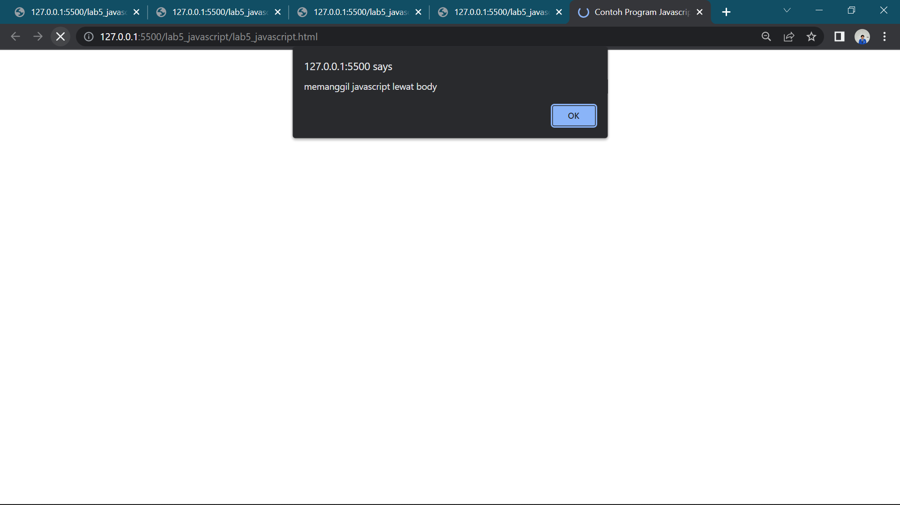

Menggunakan function dengan body onload di javascript seperti gambar diatas

### Contoh Coding
```html
<!DOCTYPE html>
<html lang="en">
<head>
    <meta charset="UTF-8">
    <meta http-equiv="X-UA-Compatible" content="IE=edge">
    <meta name="viewport" content="width=device-width, initial-scale=1.0">
    <title>Contoh Program Javascript</title>
    <script lang="javascript">
        function pesan (){
            alert("memanggil javascript lewat body ")
        }
    </script>
</head>
<body onload=pesan()>
    
</body>
</html>
```

## 6). Operasi Dasar Aritmetic
### Hasil
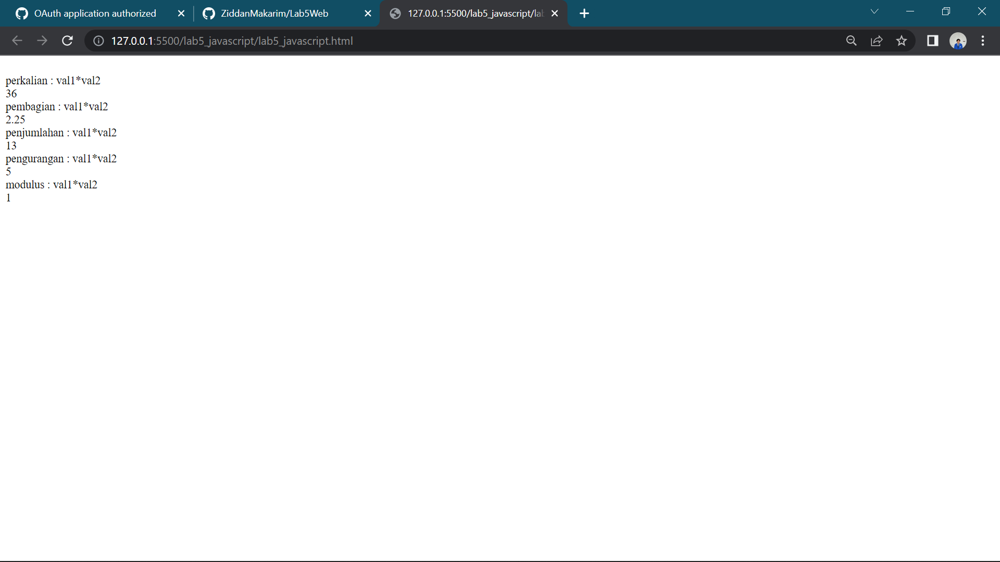

Operasi dasar aritmetic dalam javascript seperti contoh gambar diatas

### Contoh coding
```html
<!DOCTYPE html>
<html lang="en">
<head>
    <meta charset="UTF-8">
    <meta http-equiv="X-UA-Compatible" content="IE=edge">
    <meta name="viewport" content="width=device-width, initial-scale=1.0">
    <title>Contoh Program Javascript</title>
    <script lang="javascript">
        function test (val1,val2)
        {
            document.write("<br>"+"perkalian : val1*val2"+"<br>")
            document.write(val1*val2)
            document.write("<br>"+"pembagian : val1*val2"+"<br>")
            document.write(val1/val2)
            document.write("<br>"+"penjumlahan : val1*val2"+"<br>")
            document.write(val1+val2)
            document.write("<br>"+"pengurangan : val1*val2"+"<br>")
            document.write(val1-val2)
            document.write("<br>"+"modulus : val1*val2"+"<br>")
            document.write(val1%val2)
        }
    </script>
</head>
<body>
    <input type="button" value="aritmetic" name="aritmetic" onclick=test(9,4)>
</body>
</html>
```

## 7). Seleksi kondisi
### Hasil
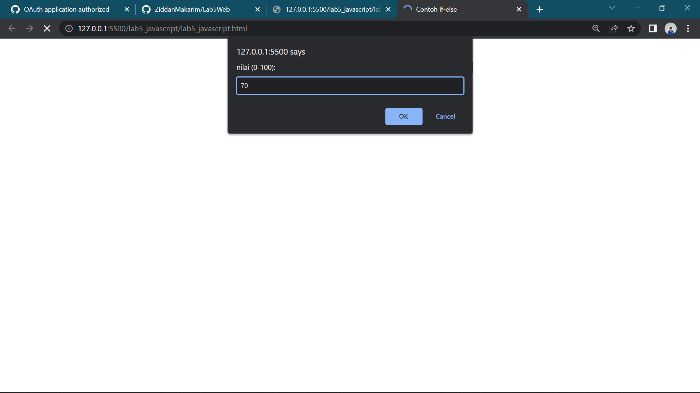
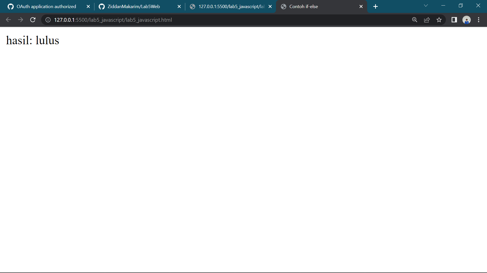

Saya memilih angka 70 untuk hasil lulus dengan program javascript pada contoh gambar diatas

### Contoh Coding
```html
<!DOCTYPE html>
<html lang="en">
<head>
    <meta charset="UTF-8">
    <meta http-equiv="X-UA-Compatible" content="IE=edge">
    <meta name="viewport" content="width=device-width, initial-scale=1.0">
    <title>Contoh if-else</title>
</head>
<body>
    <script lang="javascript">
        var nilai = prompt("nilai (0-100): ", 0)
        var hasil = "";
        if (nilai >=60)
        hasil = "lulus";
        else
        hasil = "tidak lulus"
        document.write("hasil: " + hasil);
    </script>
</body>
</html>
```

## 8). Penggunaan Operator  Switch Untuk Seleksi Kondisi
### Hasil
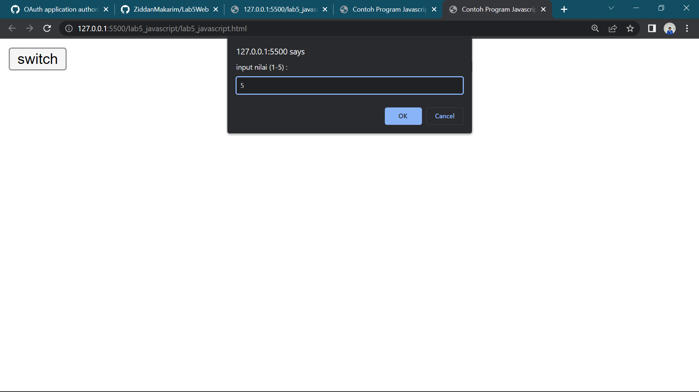
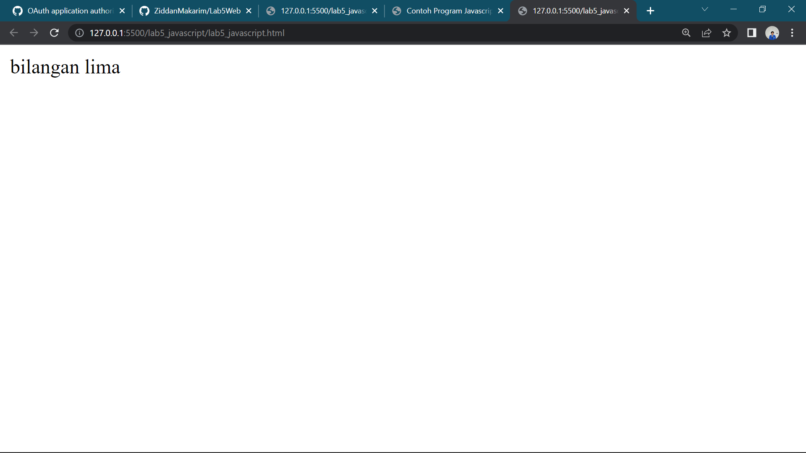

Saya memilih angka 5 untuk hasil bilangan lima dengan program javascript pada contoh gambar diatas

### Contoh Coding
```html
<!DOCTYPE html>
<html lang="en">
<head>
    <meta charset="UTF-8">
    <meta http-equiv="X-UA-Compatible" content="IE=edge">
    <meta name="viewport" content="width=device-width, initial-scale=1.0">
    <title>Contoh Program Javascript</title>
    <script lang="javascript">
        function test ()
        {
            val1=window.prompt("input nilai (1-5) :")
            switch (val1)
            {
                case "1" :
                    document.write("bilangan satu")
                    break
                case "2" :
                    document.write("bilangan dua")
                    break
                case "3" :
                    document.write("bilangan tiga")
                    break
                case "4" :
                    document.write("bilangan empat")
                    break
                case "5" :
                    document.write("bilangan lima")
                    break
                default :
                    document.write("bilangan lainnya")
            }
        }
    </script>
</head>
<body>
    <input type="button" value="switch" onclick=test()>
</body>
</html>
```

## 9). Form Input
### Hasil
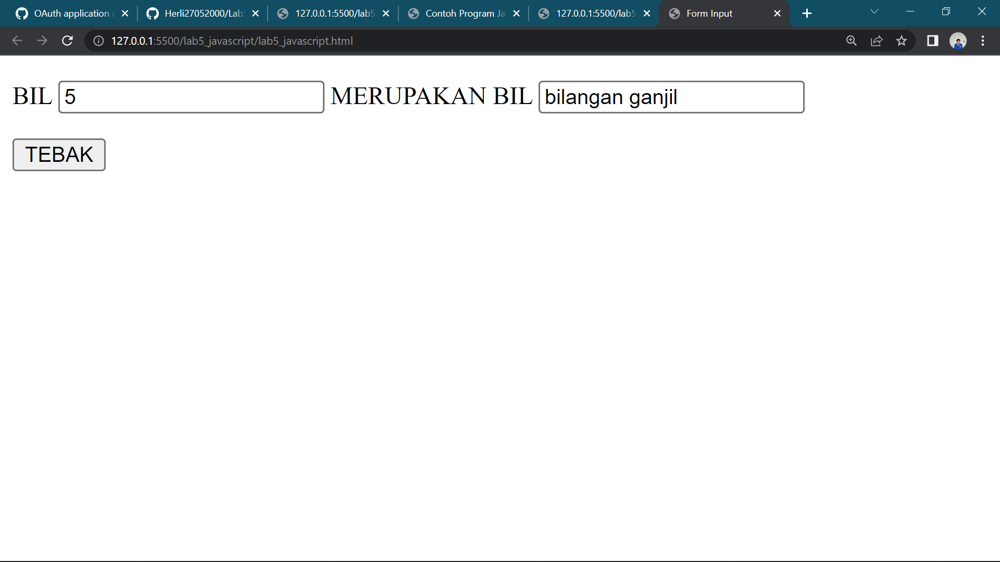

Saya memilih angka 5 untuk mendapatkan hasil bilangan ganjil dengan program javascript pada contoh gambar diatas

### Contoh Coding
```html
<!DOCTYPE html>
<html lang="en">
<head>
    <meta charset="UTF-8">
    <meta http-equiv="X-UA-Compatible" content="IE=edge">
    <meta name="viewport" content="width=device-width, initial-scale=1.0">
    <title>Form Input</title>
    <script lang="javascript">
        function test () {
            var val1=document.kirim.T1.value
            if (val1%2==0)
                document.kirim.T2.value="bilangan genap"
            else
                document.kirim.T2.value="bilangan ganjil"
        }
    </script>
</head>
<body>
    <form action="" method="post" name="kirim">
        <p>BIL <input type="text" name="T1" id="T1" size="20"> MERUPAKAN BIL <input type="text" name="T2" id="T2" size="20"></p>
        <p><input type="button" value="TEBAK" name="B1" onclick=test()></p>
    </form>
</body>
</html>
```

## 10). Form Button
### Hasil
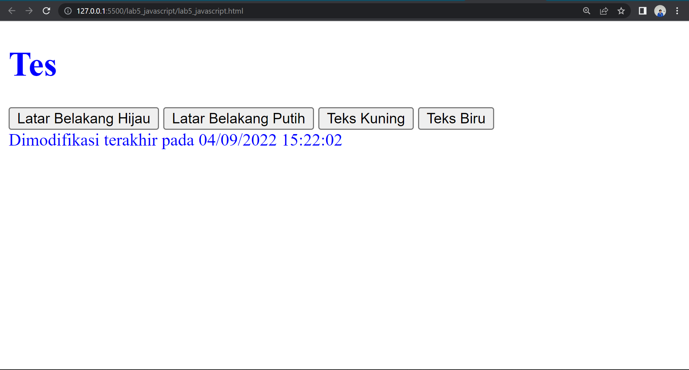

Disini menggunakan form button dengan function javascript dan html form button hasil nya adalah seperti contoh gambar di atas,saya mengklik warna putih dan teks biru seperti pada contoh gambar diatas

### Contoh Coding
```html
<!DOCTYPE html>
<html lang="en">
<head>
    <meta charset="UTF-8">
    <meta http-equiv="X-UA-Compatible" content="IE=edge">
    <meta name="viewport" content="width=device-width, initial-scale=1.0">
    <title>Objek Document</title>
</head>
<body>
    <script lang="javascript">
        function ubahWarnaLB(warna) {
            document.bgColor = warna;
        }
        function ubahWarnaLD(warna) {
            document.fgColor = warna;
        }
    </script>
    <h1>Tes</h1>
    <form action="">
        <input type="button" value="Latar Belakang Hijau" onclick="ubahWarnaLB('GREEN')">
        <input type="button" value="Latar Belakang Putih" onclick="ubahWarnaLB('WHITE')">
        <input type="button" value="Teks Kuning" onclick="ubahWarnaLD('YELLOW')">
        <input type="button" value="Teks Biru" onclick="ubahWarnaLD('BLUE')">
    </form>
    <script lang="javascript">
        document.write("Dimodifikasi terakhir pada " + document.lastModified);
    </script>
</body>
</html>
```

## 11).  HTML DOM Menggunakan Checkbox Dengan Perhitungngan Otomatis
### Hasil
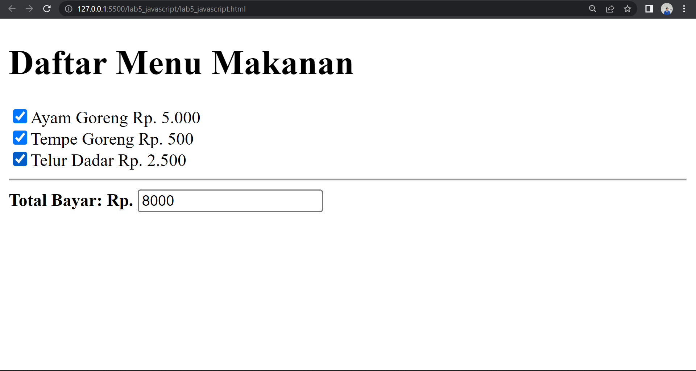

Disini menggunakan HTML DOM dengan input type checkbox sebagai contoh gambar di atas menghitung secara otomatis.

### Contoh Coding
```html
<!DOCTYPE html>
<!-- file daftar menu.html -->
<html lang="en">
<head>
    <meta charset="UTF-8">
    <meta http-equiv="X-UA-Compatible" content="IE=edge">
    <meta name="viewport" content="width=device-width, initial-scale=1.0">
    <title>Daftar Menu</title>
    <script lang="javascript">
        function hitung(ele) {
            var total = document.getElementById('total').value;
                total = (total ? parseInt(total) : 0);
            var harga = 0;

            if (ele.checked) {
                harga = ele.value;
                total += parseInt(harga);
            } else {
                harga = ele.value;
                if (total > 0)
                    total -= parseInt(harga);
            }
            document.getElementById('total').value = total;
        }
    </script>
</head>
<body>
    <h1>Daftar Menu Makanan</h1>
    <label><input type="checkbox" value="5000" name="menu1" id="menu1" onclick="hitung(this);">Ayam Goreng Rp. 5.000</label><br>
    <label><input type="checkbox" value="500" name="menu2" id="menu2" onclick="hitung(this);">Tempe Goreng Rp. 500</label><br>
    <label><input type="checkbox" value="2500" name="menu3" id="menu3" onclick="hitung(this);">Telur Dadar Rp. 2.500</label><hr>
    <strong>Total Bayar: Rp. <input type="text" name="total" id="total"></strong>
</body>
</html>
```